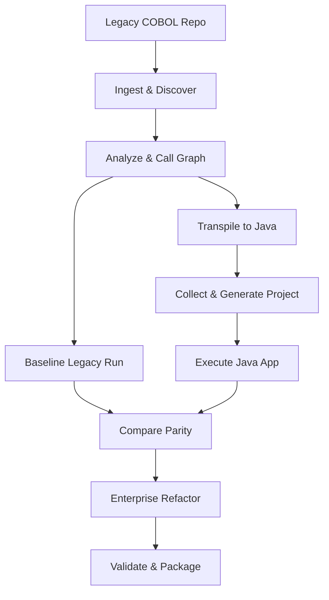

# COBOL-to-Java Modernization Platform Overview

Welcome to the **COBOL-to-Java Modernization Platform** project overview. This document provides a comprehensive technical guide to the system's goals, execution pipeline stages, translation mechanics, architectural workflow, achievements, gaps, and recently resolved issues.

---

## 1. Project Goal

The primary goal of this project is to deliver a **repository-agnostic, fully automated COBOL-to-Java modernization pipeline and validation suite**. 

Unlike traditional modernization tools that translate COBOL to heavily obfuscated Java utilizing custom emulation runtimes (e.g., vended emulation JARs), this platform produces **100% clean, standard, runtime-independent native Java code** (Spring Boot, Spring Batch, Spring Data JPA, and REST APIs). 

Additionally, the project integrates a standalone **Audit Verification Engine** and an interactive **Web Portal Dashboard** to dynamically run pipelines, stream logs in real-time, compare functional equivalence, and explore the modernized codebase.

---

## 2. Platform Architecture & Workflow

The platform follows a highly modular, decoupled architecture separating source parsing, code generation, legacy/target execution execution, functional comparison, and enterprise refactoring.



### The 13 Pipeline Execution Stages
The orchestrator (`cobol_migrate.py`) manages the modernization lifecycle through **13 distinct stages**:

1. **Ingest**: Fingerprint source repositories and calculate a SHA-256 baseline for source immutability verification.
2. **Discover**: Auto-detect directory structures, COBOL files (`.cob`/`.cbl`), copybooks (`.cpy`), entry points, and format layouts (fixed vs. free format).
3. **Analyze**: Construct logical-to-physical file mapping schemas, compute program call graphs, and scan for hardcoded literals.
4. **Baseline**: Compile and run the original legacy COBOL under GnuCOBOL, capturing golden outputs (data files, reports, stdout).
5. **Transpile**: Invoke Open Source COBOL 4J (`cobj`) within a Docker container to produce raw Java classes.
6. **Collect**: Post-process and compile Java classes locally, verifying stubs, array modifications, and syntax corrections.
7. **Preserve**: Vendor required runtime dependencies (`libcobj.jar`).
8. **Generate**: Assemble the target Java project structures and emit a machine-readable provenance manifest.
9. **Execute**: Run the transpiled Java code using identical inputs to generate modernized output files.
10. **Compare**: Conduct physical, logical (SQLite database schemas for index files), and semantic comparisons between legacy and Java outputs.
11. **Refactor**: Scaffold a fully decoupled Spring Boot enterprise application from COPYBOOK schemas, incorporating a Spring Batch chunk loader, JPA repositories, and REST API controllers.
12. **Validate**: Perform integration and smoke tests on the generated Spring Boot package (using Maven compilation checks).
13. **Package**: Bundle the modernized source code, build configurations, and reports into a distributable target ZIP package.

---

## 3. Translation Mechanics (How it Works)

The translation from COBOL to Java is accomplished through an AST-driven translation engine:

1. **Lexical Scanning (`modernize/lexer.py`)**: Tokenizes the raw COBOL source code, dynamically resolving copybook inclusions (`COPY` statements) and auto-detecting fixed or free margin formats.
2. **Syntactic Parsing (`modernize/parser.py`)**: Parses statements into a compiler-independent Abstract Syntax Tree (AST) composed of `SemanticIRNode` nodes.
3. **Control Flow Resolving (`modernize/control_flow.py`)**: Constructs paragraph execution paths and handles fall-through blocks, GOTO statements, and nested paragraph scopes.
4. **Native Generation (`modernize/native_generator.py`)**: Converts the semantic AST into clean Java code:
   - Maps COBOL variables (level numbers, PIC formats, REDEFINES) to native types (`int`, `long`, `String`, `BigDecimal`).
   - Converts COBOL commands (`MOVE`, `ADD`, `PERFORM`, `EVALUATE`, `IF`) into standard Java expressions and structures.
5. **Enterprise Scaffolding (`modernize/enterprise_generator.py`)**: Inspects COPYBOOK schemas to dynamically construct JPA Entity classes, Spring Data Repository interfaces, Spring Batch chunk processing steps, and REST endpoints for query access.

---

## 4. Functionalities & Capabilities Achieved

The platform has achieved a highly robust set of features:

- **Clean Runtime-Independent Code**: Generated Java is 100% free of custom legacy emulation imports.
- **Indexed File Comparer**: Legacy index files (e.g. GnuCOBOL `.dat` ISAM structures) are compared semantically with Java outputs by parsing them into SQLite tables, avoiding false physical mismatch verdicts.
- **Interactive Scenarios Watchdog**: Detects COBOL `ACCEPT` statements and runs them deterministically against discovered CLI test scripts/fixtures. A watchdog protects against infinite loops and limits output volumes.
- **Intrinsic Functions Support**: Fully supports `FUNCTION NUMVAL(X)` (string-to-numeric format cleaner) and `FUNCTION MOD(A, B)` (modulo calculations).
- **Interactive Web UI**: Enables portal management with real-time log streaming via Server-Sent Events (SSE), directory graphs, and a state-dependent Modernization Verdict card.
- **Zero-Dependency Guard**: Integrates validation gates scanning output artifacts for forbidden legacy libraries, blocking incorrect certifications.

---

## 5. Recently Fixed Issues & Bugs

We have recently resolved several critical pipeline bugs:

1. **Reference Modification Compiler Error**:
   - *Issue*: COBOL slice syntax like `AUDIT-LINE (25:13)` was translated as broken array bracket syntax `audit_line[24:37]`.
   - *Fix*: Mapped slice references to valid `.substring(24, 37)` Java calls.
2. **Nested Scope Loop Statement Leakage**:
   - *Issue*: Trailing statements after nested loop conditions leaked out and executed within outer loops.
   - *Fix*: Added conditional loop boundary verification to prevent scope leakage.
3. **`SPACES` String Condition Translation**:
   - *Issue*: Comparisons like `VAR NOT = SPACES` translated to references to undefined `spaces` variables.
   - *Fix*: Mapped `SPACE`/`SPACES` to `""` in Java string equality assertions.
4. **`FUNCTION NUMVAL` Translate Failure**:
   - *Issue*: Literal transpilation of NUMVAL caused compile crashes in Java.
   - *Fix*: Added a static `numval(String)` decoder to `CobolFormatHelper.java` and mapped NUMVAL expressions to it.
5. **`FUNCTION MOD` Translate Failure**:
   - *Issue*: `FUNCTION MOD(WS-YEAR, 4)` was output literally, resulting in Java syntax errors.
   - *Fix*: Added `mod` overloads in `CobolFormatHelper.java`, mapped expressions and conditions to it, and resolved type assignments to primitive integers.
6. **Web UI Card Updates**:
   - *Issue*: The verdict card updated with intermediate `PARTIAL`/`FAILED` errors during execution.
   - *Fix*: Locked the verdict card to `UNVERIFIED` during runs, updating only on final completion or failure.

---

## 6. Known Gaps & Limitations

While highly capable, the platform currently bypasses or stubs features that require manual design:

- **Embedded DB2/SQL Statements**: SQL statements are stubbed and require manual database connector configurations.
- **Dynamic `CALL` Variables**: Program targets in `CALL` statements containing dynamic variables cannot be statically mapped.
- **CICS maps / screens**: Ignored; transaction screens are bypassed and must be manual redesigned as REST endpoint mappings.

---

## 7. Next Steps for verification

To run locally and verify that everything works correctly:

- **Run the full test suite**:
  ```powershell
  python -m pytest
  ```
- **Execute local verification audits**:
  ```powershell
  python audit_engine.py --full
  ```
- **Start the Portal Web UI**:
  ```powershell
  python ui.py
  ```
  Then browse to `http://localhost:8787` to execute local migrations.
