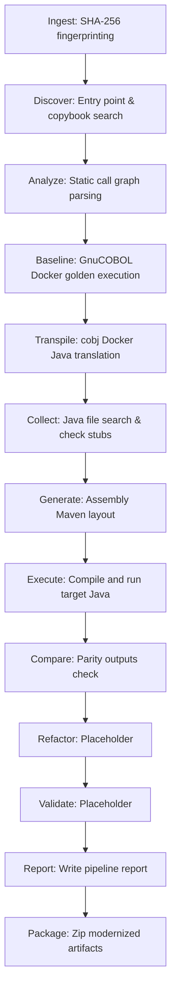

# Phase 2: Architecture Review

## 1. Architectural Review Mappings
Here is the structural review of the pipeline flow for SystemaOps:

## 2. Component Analysis
- **Ingestion & Discovery**: Ingestion calculates file hashes. Discovery scans file extensions (`.cob`/`.cbl`) to construct local repositories.
- **Static Analysis & Dependency Graph**: Scans files for static `CALL` statements to draw call-graphs. Unresolved dynamic paths are labeled.
- **Scenario Discovery**: Prioritizes test scripts containing heredoc markers to build transaction scenarios.
- **Execution & Equivalence**: Emulates running COBOL and Java using standard docker command line wrappers. Parity compares directory changes.
