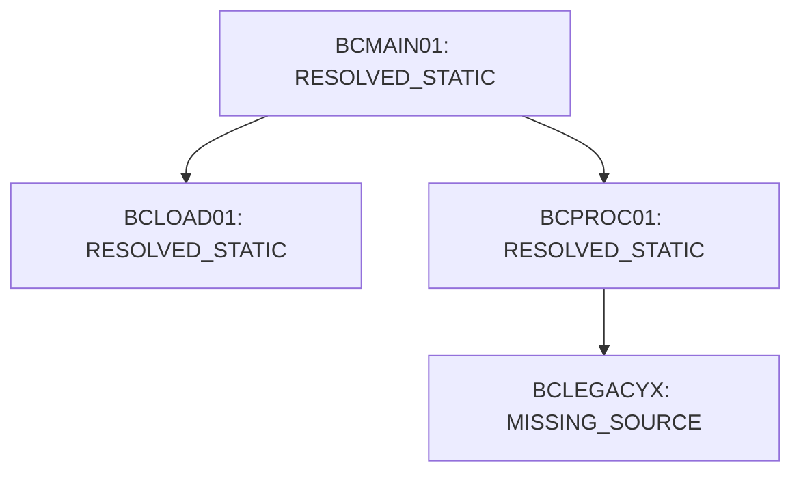

# Phase 2: Dependency Graph & CALL Resolution Tracking

We define the tracking contract for subprogram calls, ensuring unresolved routes are explicitly reported:

## 1. CALL Target Statuses
- `RESOLVED_STATIC`: Static target is located, parsed, and translated.
- `RESOLVED_DYNAMIC`: Dynamic variable values mapped to specific targets.
- `UNRESOLVED_DYNAMIC`: Variable target cannot be analyzed statically.
- `UNSUPPORTED`: Unimplemented JCL or mainframe utility calls (e.g. `SORT`).
- `MISSING_SOURCE`: Program makes static calls to source files not present in the repository.

## 2. Traceability Call Graph

No unresolved or missing sources are silently stubbed; they are explicitly flagged in validation reports.
