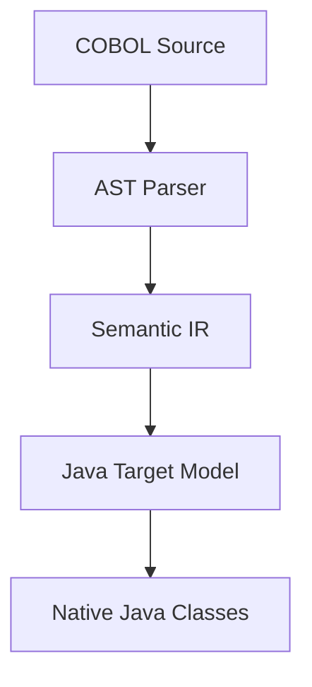

# Phase 2: Native Java Target Model & Generation Architecture

This document defines the architecture of native Java target components:

## 1. Native Java Transformation Chain

## 2. Target Component Structures
- **Domain Models**: Plain Old Java Objects (POJOs) representing variables and group items using native Java types (`String`, `int`, `BigDecimal`).
- **Business Services**: Clean classes implementing transaction processing logic.
- **Repository Interface**: Standard JDBC or JPA persistence abstractions (if files or SQL mapping are requested).
- **Unit Tests**: Standard Junit tests verifying calculations under boundary values.
