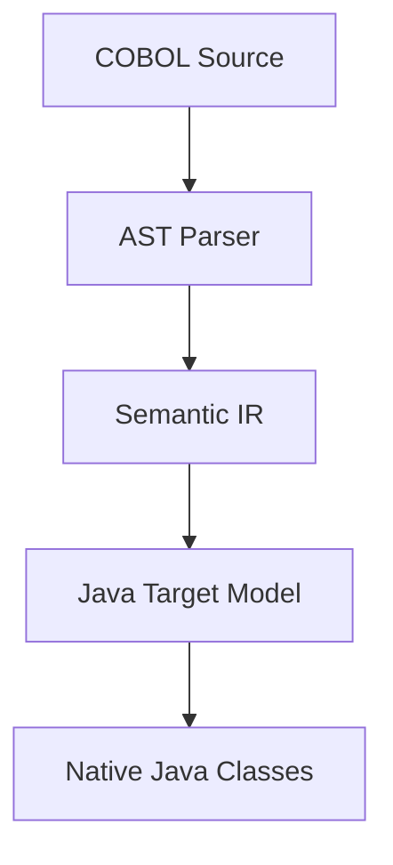

# Phase 2: Generic Native Java Architecture

To ensure modernization maps COBOL to clean native code, the generator maps from intermediate models:

## 1. Native Java Transformation Chain

## 2. Target Component Structures
- **Domain Models**: Native Java types (`String`, `BigDecimal`) mapping variables and group items.
- **Business Services**: Execution procedures mapped to clear Java method blocks.
- **Repository Abstractions**: Interface bindings for file or SQLite operations.
- **Unit Tests**: Coverage tests verifying logic under boundary values.
