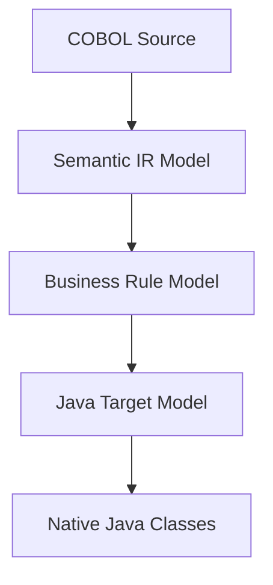

# Phase 2 Architecture Review and Validation Report

## 1. Current State Matrix
- **Ingestion & Discovery**: Functional.
- **Baseline Runs**: Functional under Docker wrappers.
- **Behavioral Comparison**: Hardcoded and subject to empty-output loophole.
- **Native Java Translation**: Tight emulation library coupling.

## 2. Target Architecture

## 3. Scope Verification
Phase 2 focuses strictly on generic comparator hardening and Call-graph tracing. Native Java transformations are deferred.
