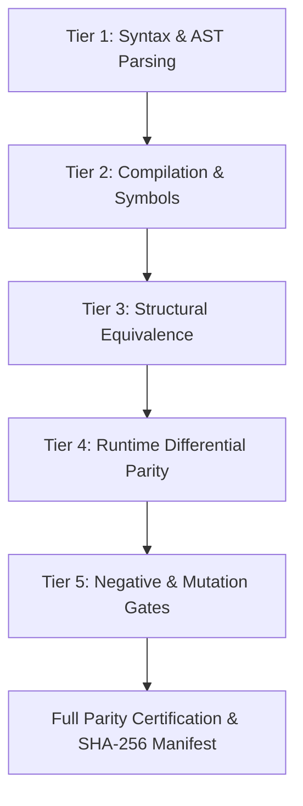

# 5-Tier Certification & Compliance Specification

This document details the formal 5-tier certification model for certifying COBOL-to-Java migration projects.

---

## 1. Tier Definitions

### Tier 1: Syntax & AST Completeness (Weight: 20 pts)
- Full extraction of all divisions, sections, paragraphs, variables, and copybooks.
- Zero fatal syntax errors or silent statement drops.
- **Fail-Closed Gate:** Any unresolved copybook or unhandled statement blocks Tier 1.

### Tier 2: Compilation & Symbol Resolution (Weight: 20 pts)
- Generated Java source code compiles with zero errors under standard OpenJDK 17+.
- All references to variables, subroutines, SQL helpers, and runtime primitives resolve cleanly.
- Maven/javac build gate returns exit code `0`.

### Tier 3: Structural & Semantic Equivalence (Weight: 20 pts)
- Control-flow graph (CFG) parity: Branching structures, perform loops, and fallthroughs correspond 1:1 with COBOL paragraphs.
- Symbol mapping: Variable types, signs, precisions, and storage scales are preserved.

### Tier 4: Runtime Differential Equivalence (Weight: 20 pts)
- Differential comparison between GnuCOBOL/Mainframe baseline and Java runtime:
  - **Exit Codes:** Exact match (`0 == 0`).
  - **Stdout & Stderr:** Byte-level match or line-ending normalized match.
  - **Output Files:** Bit-for-bit identical record layouts in `data/out/*`.
  - **Database State:** Identical rows, columns, and transactional state mutations in real PostgreSQL.

### Tier 5: Negative & Mutation Hardening (Weight: 20 pts)
- **Negative Gate:** 0% false positives when executed against corrupted baselines, altered stdout, tampered exit codes, or missing records.
- **Mutation Gate:** 100% detection rate when deliberate semantic mutations are injected into generated Java logic.

---

## 2. Certification Verdicts

| Overall Score | Certification Grade | Result | Description |
|---|---|---|---|
| **100 pts** | **`CERTIFIED_FULL_PARITY`** | **PASS** | Validated across all 5 tiers with real baseline and runtime evidence. |
| **80 - 95 pts** | **`CERTIFIED_COMPATIBILITY`** | **WARNING** | Validated under compatibility runtime (e.g. JCL/CICS emulator). |
| **50 - 75 pts** | **`PARTIALLY_CERTIFIED`** | **WARNING** | Syntactic and compilation verified; runtime unproven. |
| **< 50 pts** | **`REJECTED`** | **FAIL / BLOCKED** | One or more tier gates failed or unsupported constructs encountered. |
