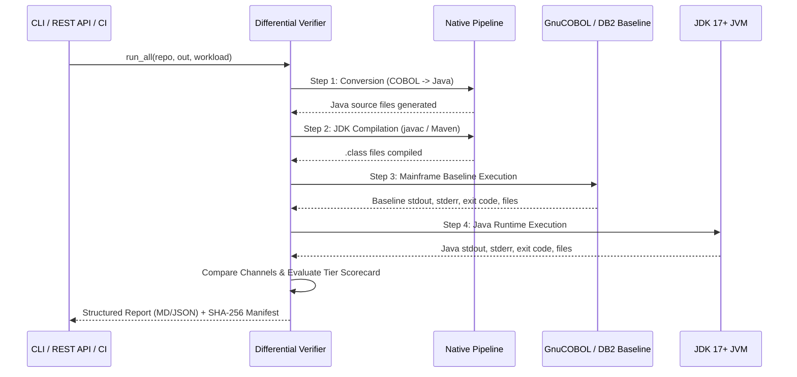

# Mentor 4-Step Differential Verifier Architecture

The Canonical Mentor 4-Step Differential Verifier (`tools/cobol_java_differential_verifier.py`) provides an automated, reproducible bridge between mainframe legacy execution and modern Java applications.

---

## 1. The 4 Verification Steps



---

## 2. CLI Usage

```bash
# Verify a single workload:
python tools/cobol_java_differential_verifier.py --repo tests/repos/SIMPLEBASELINE01 --workload SIMPLEBASELINE01 --json

# Run all canonical benchmark workloads:
python tools/cobol_java_differential_verifier.py --verify-all
```

---

## 3. Output Artifacts

For each workload `<WORKLOAD>`, the verifier writes:
1. `reports/<WORKLOAD>/differential_validation_report.md`: Markdown summary for humans.
2. `reports/<WORKLOAD>/differential_validation_report.json`: Machine-readable JSON summary.
3. `reports/<WORKLOAD>/certification_scorecard.json`: 5-Tier certification scores and evidence.
4. `reports/<WORKLOAD>/CERTIFICATION_REPORT.md`: Printable audit certificate.
