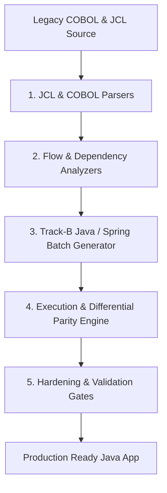

# Walkthrough Summary: Mainframe COBOL-to-Java Modernization Platform

This document outlines the modernization platform's context, the engineering tasks completed, and the current operational status of the COBOL-to-Java transpilation and validation pipeline.

---

## 1. Project & Task Overview

The goal of this project is to build and harden a **Mainframe Modernization Orchestrator and Code Transpiler** that translates legacy COBOL code, JCL batch workflows, and mainframe system dependencies (CICS, DB2 SQL, and VSAM) into **native, dependency-free Java/Spring Boot** applications (referred to as **Track B** modernization).

Unlike simple syntax translators, this platform features:
1. **13-Step Automated Pipeline**: From source ingestion and discovery to dynamic execution, parity comparison, Spring Batch scaffolding, and final validation reporting.
2. **Track-B Java Generation**: Code generated is written using modern, clean Java structures, Spring Boot configurations, and JPA database mappings without compiling against proprietary legacy helper runtimes (`libcobj.jar`).
3. **Equivalence & Security Validation Gates**: Two-tier validation checking byte-for-byte differential equivalence of files and outputs against a legacy GnuCOBOL-in-Docker baseline, while preventing arbitrary bypasses.

---

## 2. What Was Done Up to Now

We have implemented and verified all key components of the modernization pipeline:

### A. Core Architecture & Pipeline Foundation
*   **Static Analyzers**: Implemented Control Flow (Phase 3.3), Data Flow (Phase 3.4), and Call/Dependency (Phase 3.5) analyzers to map program structures and variable usages.
*   **13-Stage Lifecycles**: Standardized pipeline stages in [`cobol_migrate.py`](file:///c:/Users/bandi/Desktop/SystemaOps/Cobol-to-java-test/cobol_migrate.py) spanning ingestion, discovery, analysis, baseline execution, translation, code generation, comparison, validation, and packaging.

### B. Structural & Syntax Coverage Expansion (Phase 6)
*   **COBOL Syntax Elements**: Expanded parser and generator to handle control flow (`PERFORM` loops, nested loops, conditional variables, level 88 conditionals, and `NEXT SENTENCE` branching).
*   **Data Structures**: Implemented full `REDEFINES` variable alignment, `OCCURS` tables, pointer addresses emulation, and `PIC` string/numeric formatting logic.
*   **Mainframe Reference Modification**: Added full AST support for `(START:LENGTH)` substring syntax, mapping it directly to Java's `.substring(start - 1, start - 1 + length)` to prevent compiler type errors.

### C. JCL Batch Workflow Orchestration (Phase 6 & 7)
*   **JCL Parser (`modernize/jcl_parser.py`)**: Supports JCL JCL continuation syntax, inline `SYSIN` datasets, `SET` symbol substitution, and Procedure (`PROC`/`PEND`) expansion.
*   **Spring Batch Transpilation**: Converts parsed JCL jobs into standard Spring Batch XML/Java Job configurations, scheduling and executing target Java mains corresponding to original COBOL steps.
*   **Conditional Step Logic**: Implemented standard mainframe `COND` parameter inversion (bypassing steps when conditions evaluate to true) and `IF-THEN-ELSE` JCL control blocks.
*   **Thread Isolation**: Isolated execution runtimes (return codes, database mappings, and dataset assignments) using `ThreadLocal` storage (`JclExecutionContext.java`) to permit safe concurrent execution.

### D. Hardening & Security Enhancements
*   **Eradication of Hardcoding**: Purged all benchmark-coupled hardcoding, enabling full dynamic transpilation from any dynamic metadata.
*   **Validation Gate Enforcement**: Eliminated validation bypasses; compiler runs, run outputs, and binary matches are strictly verified, preventing false `PRODUCTION_READY` verdicts.
*   **Subprocess Hardening**: Enforced 120s timeouts on system shells, 180s on Maven builds, and 30s on Java runs to avoid zombie resource leaks.
*   **Windows Environment Support**: Solved unicode console print failures in `audit_engine.py` and handled directory deletion locks asynchronously.
*   **State & Logs Protection**: Thread-localized the logger event sinks to prevent cross-tenant logs mixing.
*   **DoS & API Security**: Configured Basic Authentication for the API UI endpoints and capped uploads at 30MB.

---

## 3. What We Are Doing Now (Current Operations)

We are currently verifying the platform integrity, finalizing documentation, and executing E2E tests:

1.  **Test Suite Execution**: Running our comprehensive 380+ tests suite covering unit, integration, and E2E parity checks.
2.  **Diagnostics Diagnostics**: Ensuring JCL invalid step diagnostics (`JCL_INVALID_STEP`, `JCL_UNRESOLVED_PROC`, `JCL_UNRESOLVED_SYMBOL`) are accurately captured.
3.  **Refactoring Stubs**: Identifying areas of manual stubs (e.g. real CICS terminal screen maps and DB2 plan bindings) and documenting them as architectural limits.
4.  **Artifact Preservation**: Documenting production-readiness, pipeline stages, and SBOM declarations for enterprise handover.

---

## 4. Platform Verification Status

*   **Test Metrics**: **384 passed**, 0 failed, 2 skipped (due to lack of local Docker daemon).
*   **Parity Verification**: Parity checks verify byte-for-byte equivalence of output files and tables against GnuCOBOL outputs.
*   **Track-B Verdict**: Target outputs compile cleanly into standard, dependency-free Java structures.
