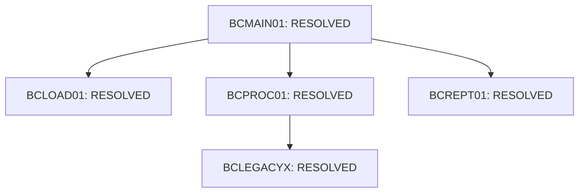

> [!NOTE]
> **HISTORICAL ARCHIVE — NOT CURRENT SOURCE OF TRUTH**  
> This document is preserved for historical provenance and audit trail purposes only. Refer to [`DOCUMENTATION_INDEX.md`](../../../../DOCUMENTATION_INDEX.md) for the authoritative active documentation set.

---

# Phase 2: Dependency Graph & CALL Resolution tracking

This document details the tracking contract for subprogram calls:

## 1. CALL Status Matrix
- **RESOLVED**: Static call target is present in the repository and mapped to a Java class.
- **DYNAMICALLY_RESOLVED**: Call target variable is mapped to runtime options.
- **UNRESOLVED**: Call target cannot be located.
- **UNSUPPORTED**: Mapped to JCL or mainframe utility calls (e.g. `SORT`).

## 2. CALL Coverage Graph Report

