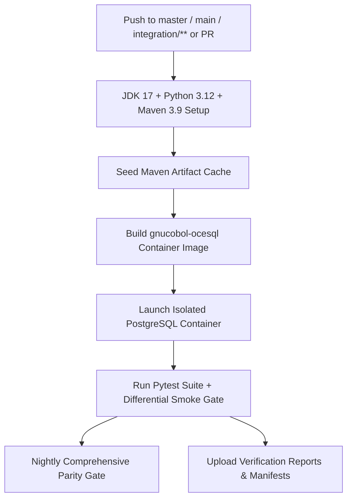

> [!NOTE]
> **HISTORICAL ARCHIVE — NOT CURRENT SOURCE OF TRUTH**  
> This document is preserved for historical provenance and audit trail purposes only. Refer to [`DOCUMENTATION_INDEX.md`](../../../DOCUMENTATION_INDEX.md) for the authoritative active documentation set.

---

# CI / CD Pipeline Verification (Phase 15)

**Audit Date:** 2026-09-01T20:56:00Z  
**Workflow File:** `.github/workflows/ci.yml`  

---

## 1. CI Pipeline Architecture

---

## 2. CI Verification Checklist

| Requirement | Implementation Status | Evidence / Verification |
|---|---|---|
| **Branch Triggers** | `master`, `main`, `integration/**`, PRs | Configured in `.github/workflows/ci.yml` |
| **JDK Version** | OpenJDK 17 (Temurin) | `actions/setup-java@v4` with temurin 17 |
| **Python Version** | Python 3.12 / 3.14 compatible | `actions/setup-python@v5` |
| **Maven Cache** | Seeded deterministically | `docker/maven-seed-pom.xml` dependency resolver |
| **Docker Toolchain** | GnuCOBOL 3.2 + OCESQL 2.0 | `Dockerfile.gnucobol-ocesql` build layer verification |
| **Database Container** | PostgreSQL 16 Alpine | Container network isolation with `PG_CONTAINER_NAME=db` |
| **Differential Smoke Gate**| Enabled on fast lane | Runs unit, component, differential, negative, and mutation suites |
| **Artifact Collection** | Enabled | Preserves reports, manifests, and test logs on failure |
