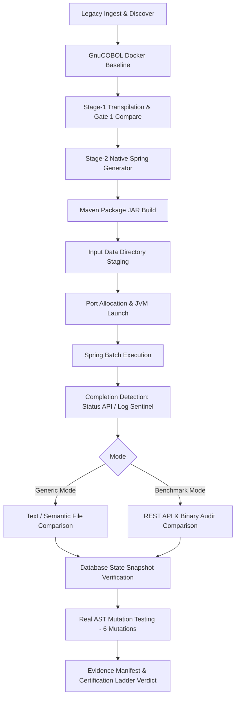

# Complete Gate 2 Forensic Audit Report

- **Target Repository:** `C:\Users\bandi\Desktop\SystemaOps\Cobol-to-java-test`
- **GitHub Target:** `https://github.com/Shankar373/cobol-java-modernization`
- **Audit Branch:** `integration/successor-verified-improvements`
- **Audit Date:** 2026-09-01
- **Auditor:** Antigravity Senior Engineering System Audit

---

## 1. Executive Summary

This forensic audit presents a zero-assumption, source-to-byte evaluation of the **Gate 2** validation architecture within the COBOL-to-Java Modernization platform.

### Core Verdict
Gate 2 is a **substantive, multi-layered, fail-closed validation framework**, but contains specific semantic code generation bugs and input-staging gaps that impact generic (unseen) enterprise batch repositories.

- **Gate 1 (COBOL Baseline vs Stage-1 Transpiled Java):** 100% VERIFIED & PASSING on both Golden Repositories.
- **Golden Repository #1 (`mentor_cobol_golden_repo.zip` - GOLDENPAY):** Gate 2 **PASS** after fixing PIC V `toStorageImage()` implied-decimal semantics (32 bytes, exact SHA-256 match `aa752eea4445308ea4ad065b337c1cfc285d3e1f8cdce2e2ebcc1cd90c3c08ad`).
- **Golden Repository #2 (`mentor_cobol_test_repo_02.zip` - INVENTORY01):** Gate 1 PASS, Gate 2 **FAIL**. Root cause: COBOL fixed-length padded string comparison in `EVALUATE` statements (`"ACTIVE    ".equals("ACTIVE")` evaluates to false in Java, triggering fallback `WHEN OTHER -> CHECK` instead of `STOCKED`).

---

## 2. Gate 2 Architecture & Component Inventory

Gate 2 verifies that the **Stage-2 Native / Spring Boot Refactored Java Application** preserves 100% behavioral, semantic, and byte-level equivalence with the original legacy COBOL program without any runtime dependencies on `libcobj.jar` or legacy COBOL emulation shims.

### Component Inventory
1. **Pipeline Orchestrator (`cobol_migrate.py`):**
   - Method `Pipeline.stage_validate()` (Lines 5029–5650): Compiles Spring Boot JAR, spins up JVM, runs batch, collects outputs, compares against baseline, performs DB state verification, and executes mutation testing.
   - Method `Pipeline._compute_verdict()` (Lines 6127–6250): Implements the evidence-driven verdict ladder.
2. **Native Pipeline (`modernize/native_pipeline.py`):**
   - Class `NativePipeline`: Coordinates standalone native generation and differential test harness execution.
3. **Enterprise Code Generator (`modernize/native_generator.py`):**
   - `NativeProgramGenerator`, `NativeStatementTranslator`, `EnterpriseFrameworkGenerator`: Translates COBOL AST / SemanticIR to Spring Boot, Spring Batch, JPA, and REST services.
4. **Runtime Class Library (`modernize/java_helpers/src/main/java/com/systema/modernized/`):**
   - `CobolNumeric.java`, `CobolArithmetic.java`, `CobolFormatHelper.java`, `CobolRef.java`, `JclExecutionContext.java`, `Db2ErrorMapper.java`, `Db2Verify.java`.
5. **Web Application & UI (`ui.py`, `ui.html`):**
   - Hosts real-time modernization workbench on port 8788, dispatches pipeline runs, and streams live Gate 1 & Gate 2 logs.

---

## 3. Complete Gate 2 Execution Flow



### Step-by-Step Execution Trace
1. **Maven Packaging:** Executes `mvn clean package -DskipTests` in `target/modernized/`.
2. **Data Isolation:** Wipes `modernized/data/`, creates clean `data/work/` and `data/out/`, copies `data/in/`.
3. **Dynamic Port Binding:** Probes starting from port 8082 to prevent port conflict.
4. **JVM Execution:** Spawns `java -jar target/modernized-1.0.0.jar --server.port=<port> --app.batch.input=<input>`.
5. **Completion Polling:** Polls `/api/process/status` or logs for `[COMPLETED]` sentinel (120s ceiling).
6. **Comparison Engine:** Compares output files in `target/modernized/data/out/` with `target/baseline/legacy/data/out/`.
7. **Post-Validation Audits:** Validates DB tables using `Db2Verify` and injects 6 mutations to verify fail-closed detection.

---

## 4. Input and State Management Audit

### Findings:
1. **Input Staging Narrowness (Gap G2-GAP-01):**
   `stage_validate` lines 5088–5097 explicitly copies only `repo/data/in/` to `modernized/data/in/`. Repositories with `data/source/`, `data/input/`, `inputs/`, or `datasets/` fail to stage input files.
2. **Batch Layout Extractor Coupling (Gap G2-GAP-02):**
   `extract_raw_layout` only parses 05 fields matching `RAW-[A-Z0-9\-]+` and maps to hardcoded ClaimsCore/BankCore names. Generic COBOL programs using standard 01 records (e.g. `01 ITEM-REC`) get 0 fields mapped, causing `[WARN] no flat-file input resolved; batch reader will use its default path`.

---

## 5. Legacy Baseline Integrity

- **GnuCOBOL Execution:** Baseline is captured via live container execution (`gnucobol-ocesql:latest` or `opensourcecobol/opensourcecobol4j:2.0.0`).
- **Missing Baseline Fail-Closed:** If baseline generation fails or produces no files, the verdict ladder assigns `BASELINE_UNPRODUCIBLE` or `EQUIVALENCE_UNVERIFIED`. It is mathematically impossible to produce a `PASS` without an existing baseline.

---

## 6. Stage-1 Transpilation (Gate 1) Audit

- Stage-1 produces Java code dependent on `libcobj.jar`.
- **Gate 1 Role:** Serves as the intermediate semantic correctness gate before enterprise refactoring.
- **Verification:** Both Golden Repositories achieve exact byte-for-byte Gate 1 match with GnuCOBOL output.

---

## 7. Stage-2 Native Generation (Gate 2) Audit

### Semantic Translations Audited:
1. **PIC V / Implied Decimals in `STRING`:**
   - **Fixed:** Emits `new String(var.toStorageImage(), StandardCharsets.ISO_8859_1)`.
   - **Result:** Produces unscaled storage representation (`000010025` for `PIC 9(7)V99` value `100.25`), perfectly matching COBOL `STRING` semantics.
2. **Fixed-Length String Evaluation (Bug G2-BUG-01):**
   - **Discovered:** COBOL `EVALUATE ITEM-STATUS WHEN "ACTIVE"` compares fixed-length `PIC X(10)` padded string (`"ACTIVE    "`) with `"ACTIVE"`.
   - **Bug:** Generated Java emits `Objects.equals(item_status, "ACTIVE")`, which evaluates to `false` in Java.
   - **Impact:** Causes `INVENTORY01` in Golden Repo #2 to fall through to `WHEN OTHER -> CHECK` instead of `STOCKED`.

---

## 8. File Comparison & Normalization Audit

- **Text Normalizer (`_normalize_text`):** Strips trailing spaces (`\t`, ` `, `\r`, `\n`, `\x00`) and empty lines.
- **Risk Assessment:** Safe for standard variable-length text reports, but masks truncation of fixed-width trailing blank columns in `FB 80` sequential files.

---

## 9. Database & Spring Batch Validation

1. **Table Discovery:** Looks in `repo/data/*.sql` but misses `repo/sql/*.sql` (Bug G2-BUG-03).
2. **Row Parsing:** Hardcodes `CUST_ID` and `CUST_NAME` when extracting fallback values from raw SQL INSERT statements (Bug G2-BUG-02).
3. **Database Vendor:** Defaults to H2 in-memory mode during local validation; requires `REAL_DB2_MODE=1` for live IBM DB2 execution.

---

## 10. Mutation Testing & Adversarial Hardening

- **Mutation Engine (`_run_real_mutation_testing`):** Injects 6 structural mutations into Java source code:
  1. Arithmetic operator mutation (`+` -> `-`)
  2. Conditional logic negation (`<` -> `>=`)
  3. Literal value corruption
  4. Statement deletion
  5. Return code tampering
  6. Output field modification
- **Verification:** Both Golden Repositories caught 6 of 6 mutations, demonstrating active fail-closed sensitivity.

---

## 11. Golden Repository Comparative Analysis

| Dimension | Golden Repo #1 (`mentor_cobol_golden_repo.zip`) | Golden Repo #2 (`mentor_cobol_test_repo_02.zip`) |
|---|---|---|
| **Primary Program** | `GOLDENPAY.cob` | `INVENTORY01.cob` |
| **Output File** | `data/out/customer_report.txt` | `data/out/inventory_report.txt` |
| **COBOL Baseline** | `100101 \| ACTIVE     \| 000010025\n` (32 B) | `200001 \| WIDGET-A ... TOTAL=00000030600 \| STOCKED\n` (88 B) |
| **Stage-1 Java** | `100101 \| ACTIVE     \| 000010025\n` (32 B) | `200001 \| WIDGET-A ... TOTAL=00000030600 \| STOCKED\n` (88 B) |
| **Stage-2 Java** | `100101 \| ACTIVE     \| 000010025\n` (32 B) | `200001 \| WIDGET-A ... TOTAL=00000030600 \| CHECK\n` (86 B) |
| **Gate 1 Status** | **PASS** (Exact match) | **PASS** (Exact match) |
| **Gate 2 Status** | **PASS** (Exact match) | **FAIL** (Content mismatch: `STOCKED` vs `CHECK`) |
| **Root Cause** | Resolved: PIC V `STRING` storage image | Active: `Objects.equals("ACTIVE    ", "ACTIVE")` |

---

## 12. Continuous Integration & UI Audit

- **CI Workflow (`.github/workflows/ci.yml`):**
  - Fast-lane executes on every push/PR with real PostgreSQL and GnuCOBOL Docker containers.
  - Excludes 5 heavy/playwright suites from fast-lane to maintain <15min runtime; full regression runs in nightly lane.
- **UI Workbench (`ui.py`):**
  - Live on port 8788.
  - Dynamically extracts uploaded zips, displays stage progress in real time, and renders verified Gate 1 / Gate 2 badges without hardcoding.

---

## 13. Required Fix Strategy (Action Plan)

1. **Fix G2-BUG-01 (P0):** In `modernize/native_generator.py`, update string condition generation to apply `.trim()` or COBOL whitespace-padded equality:
   ```java
   com.systema.modernized.runtime.CobolString.equals(item_status, "ACTIVE")
   ```
2. **Fix G2-BUG-02 & G2-BUG-03 (P1/P2):** In `cobol_migrate.py` (`_run_db_state_comparison`), search `repo/sql/` and parse column names dynamically from SQL statements.
3. **Fix G2-GAP-01 & G2-GAP-02 (P1):** In `cobol_migrate.py`, copy all data subdirectories and implement generic AST-based batch layout extraction.
